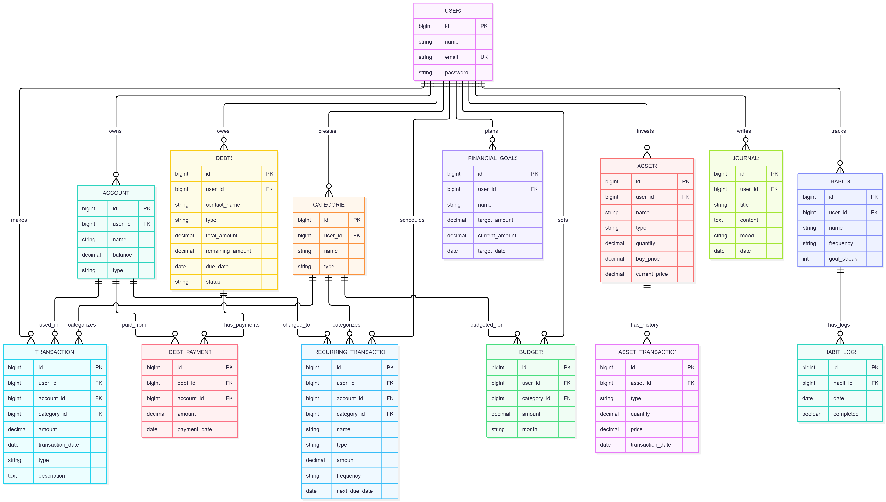
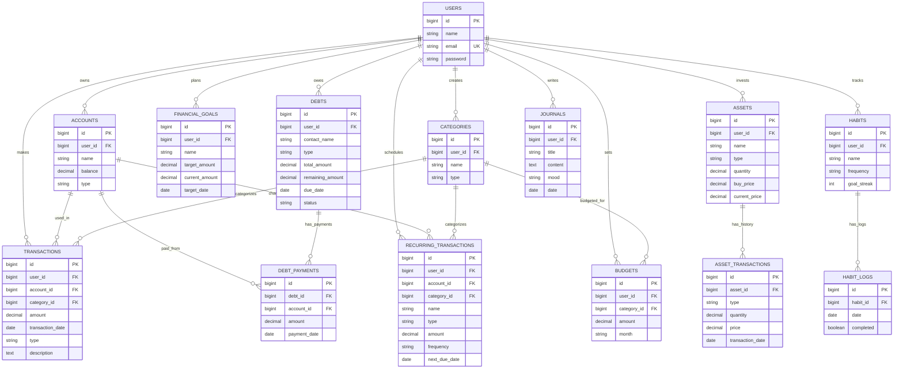

# P01 - Database Design: MySphere

**Nama Aplikasi:** MySphere  
**Deskripsi:** Aplikasi manajemen keuangan pribadi all-in-one yang mencakup pencatatan keuangan, investasi, utang, kebiasaan (habits), dan jurnal pribadi.

---

## 1. Entity Relationship Diagram

---

## 2. Relationship Summary

| Tipe Relasi | Dari | Ke | Keterangan |
|---|---|---|---|
| One-to-Many | User | Account | Satu user punya banyak akun |
| One-to-Many | User | Transaction | Satu user punya banyak transaksi |
| One-to-Many | User | Category | Satu user punya banyak kategori |
| One-to-Many | User | Budget | Satu user punya banyak anggaran |
| One-to-Many | User | Financial Goal | Satu user punya banyak target finansial |
| One-to-Many | User | Asset | Satu user punya banyak aset |
| One-to-Many | User | Debt | Satu user punya banyak utang/piutang |
| One-to-Many | User | Habit | Satu user punya banyak kebiasaan |
| One-to-Many | User | Journal | Satu user punya banyak jurnal |
| One-to-Many | User | Recurring Transaction | Satu user punya banyak transaksi berulang |
| One-to-Many | Account | Transaction | Satu akun dipakai di banyak transaksi |
| One-to-Many | Account | Debt Payment | Satu akun dipakai untuk banyak pembayaran utang |
| One-to-Many | Category | Transaction | Satu kategori untuk banyak transaksi |
| One-to-Many | Category | Budget | Satu kategori punya banyak anggaran |
| One-to-Many | Asset | Asset Transaction | Satu aset punya banyak riwayat transaksi |
| One-to-Many | Debt | Debt Payment | Satu utang punya banyak pembayaran |
| One-to-Many | Habit | Habit Log | Satu kebiasaan punya banyak log harian |

---

## 3. Category (Seeded)

Berikut adalah contoh data kategori awal yang akan di-*seed* ke dalam database untuk memudahkan pengguna dalam mencatat transaksi.

| No | Nama Kategori | Tipe | Deskripsi |
|---|---|---|---|
| 1 | Makanan & Minuman | expense | Pengeluaran untuk makan dan minum |
| 2 | Transportasi | expense | Biaya transportasi harian |
| 3 | Belanja | expense | Pembelian barang kebutuhan |
| 4 | Hiburan | expense | Pengeluaran untuk hiburan |
| 5 | Tagihan & Utilitas | expense | Listrik, air, internet, dll |
| 6 | Kesehatan | expense | Biaya kesehatan dan obat |
| 7 | Pendidikan | expense | Biaya pendidikan dan kursus |
| 8 | Gaji | income | Pemasukan dari gaji |
| 9 | Bonus | income | Pemasukan dari bonus |
| 10 | Investasi | income | Pemasukan dari hasil investasi |

---

## 4. Design Notes

- **Modularitas:** Tabel dikelompokkan menjadi 4 pilar utama: Finance, Wealth, Habits, dan Journaling.
- **Skalabilitas:** Setiap tabel terhubung ke `users`, sehingga aplikasi mendukung multi-user.
- **Fleksibilitas:** Kolom `type` pada `categories`, `transactions`, dan `assets` memungkinkan berbagai jenis data tanpa perlu membuat tabel baru.
- **Perhitungan:** Fitur seperti *Capital Loss*, *Drawdown*, dan *Budget Variance* dihitung di level aplikasi, bukan disimpan sebagai tabel terpisah.
- **Normalisasi:** Tabel `asset_transactions` tidak menyimpan `user_id` secara langsung, melainkan terhubung melalui `asset_id` untuk menghindari redundansi data.